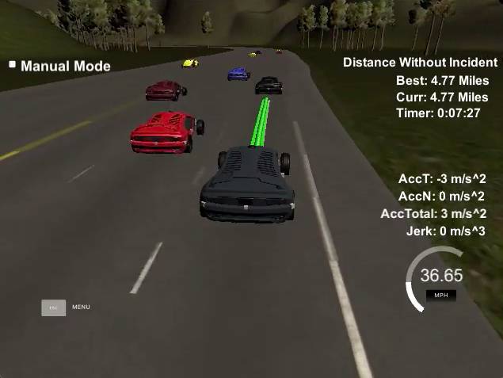

# CarND-Path-Planning-Project
Self-Driving Car Engineer Nanodegree Program

[](https://www.youtube.com/watch?v=3xxdWMC7hko)

### Simulator.
You can download the Term3 Simulator which contains the Path Planning Project from the [releases tab (https://github.com/udacity/self-driving-car-sim/releases/tag/T3_v1.2).

### Goals
In this project your goal is to safely navigate around a virtual highway with other traffic that is driving +-10 MPH of the 50 MPH speed limit. You will be provided the car's localization and sensor fusion data, there is also a sparse map list of waypoints around the highway. The car should try to go as close as possible to the 50 MPH speed limit, which means passing slower traffic when possible, note that other cars will try to change lanes too. The car should avoid hitting other cars at all cost as well as driving inside of the marked road lanes at all times, unless going from one lane to another. The car should be able to make one complete loop around the 6946m highway. Since the car is trying to go 50 MPH, it should take a little over 5 minutes to complete 1 loop. Also the car should not experience total acceleration over 10 m/s^2 and jerk that is greater than 10 m/s^3.

#### The map of the highway is in data/highway_map.txt
Each waypoint in the list contains  [x,y,s,dx,dy] values. x and y are the waypoint's map coordinate position, the s value is the distance along the road to get to that waypoint in meters, the dx and dy values define the unit normal vector pointing outward of the highway loop.

The highway's waypoints loop around so the frenet s value, distance along the road, goes from 0 to 6945.554.

## Basic Build Instructions

1. Clone this repo.
2. Make a build directory: `mkdir build && cd build`
3. Compile: `cmake .. && make`
4. Run it: `./path_planning`.

Here is the data provided from the Simulator to the C++ Program

#### Main car's localization Data (No Noise)

["x"] The car's x position in map coordinates

["y"] The car's y position in map coordinates

["s"] The car's s position in frenet coordinates

["d"] The car's d position in frenet coordinates

["yaw"] The car's yaw angle in the map

["speed"] The car's speed in MPH

#### Previous path data given to the Planner

**Note**: Return the previous list but with processed points removed, can be a nice tool to show how far along
the path has processed since last time.

["previous_path_x"] The previous list of x points previously given to the simulator

["previous_path_y"] The previous list of y points previously given to the simulator

#### Previous path's end s and d values

["end_path_s"] The previous list's last point's frenet s value

["end_path_d"] The previous list's last point's frenet d value

#### Sensor Fusion Data, a list of all other car's attributes on the same side of the road. (No Noise)

["sensor_fusion"] A 2d vector of cars and then that car's [car's unique ID, car's x position in map coordinates, car's y position in map coordinates, car's x velocity in m/s, car's y velocity in m/s, car's s position in frenet coordinates, car's d position in frenet coordinates.

## Details

1. The car uses a perfect controller and will visit every (x,y) point it recieves in the list every .02 seconds. The units for the (x,y) points are in meters and the spacing of the points determines the speed of the car. The vector going from a point to the next point in the list dictates the angle of the car. Acceleration both in the tangential and normal directions is measured along with the jerk, the rate of change of total Acceleration. The (x,y) point paths that the planner recieves should not have a total acceleration that goes over 10 m/s^2, also the jerk should not go over 50 m/s^3. (NOTE: As this is BETA, these requirements might change. Also currently jerk is over a .02 second interval, it would probably be better to average total acceleration over 1 second and measure jerk from that.

2. There will be some latency between the simulator running and the path planner returning a path, with optimized code usually its not very long maybe just 1-3 time steps. During this delay the simulator will continue using points that it was last given, because of this its a good idea to store the last points you have used so you can have a smooth transition. previous_path_x, and previous_path_y can be helpful for this transition since they show the last points given to the simulator controller with the processed points already removed. You would either return a path that extends this previous path or make sure to create a new path that has a smooth transition with this last path.

## Tips

A really helpful resource for doing this project and creating smooth trajectories was using http://kluge.in-chemnitz.de/opensource/spline/, the spline function is in a single hearder file is really easy to use.

---

## Dependencies

* cmake >= 3.5
  * All OSes: [click here for installation instructions](https://cmake.org/install/)
* make >= 4.1
  * Linux: make is installed by default on most Linux distros
  * Mac: [install Xcode command line tools to get make](https://developer.apple.com/xcode/features/)
  * Windows: [Click here for installation instructions](http://gnuwin32.sourceforge.net/packages/make.htm)
* gcc/g++ >= 5.4
  * Linux: gcc / g++ is installed by default on most Linux distros
  * Mac: same deal as make - [install Xcode command line tools]((https://developer.apple.com/xcode/features/)
  * Windows: recommend using [MinGW](http://www.mingw.org/)
* [uWebSockets](https://github.com/uWebSockets/uWebSockets)
  * Run either `install-mac.sh` or `install-ubuntu.sh`.
  * If you install from source, checkout to commit `e94b6e1`, i.e.
    ```
    git clone https://github.com/uWebSockets/uWebSockets
    cd uWebSockets
    git checkout e94b6e1
    ```

## Project Instructions and [Rubric](https://review.udacity.com/#!/rubrics/1020/view)

### Compilation

1. The code compiles correctly.

   Code compiles correctly with `cmake`. No changes were made except formating. New file [src/spline.h](https://github.com/jinay1991/CarND-Path-Planning-Project/blob/master/src/spline.h) was added to repo.

    ```bash
    Jinays-Air:build jinay$ cmake ..
    -- The C compiler identification is AppleClang 10.0.0.10001044
    -- The CXX compiler identification is AppleClang 10.0.0.10001044
    -- Check for working C compiler: /Library/Developer/CommandLineTools/usr/bin/cc
    -- Check for working C compiler: /Library/Developer/CommandLineTools/usr/bin/cc -- works
    -- Detecting C compiler ABI info
    -- Detecting C compiler ABI info - done
    -- Detecting C compile features
    -- Detecting C compile features - done
    -- Check for working CXX compiler: /Library/Developer/CommandLineTools/usr/bin/c++
    -- Check for working CXX compiler: /Library/Developer/CommandLineTools/usr/bin/c++ -- works
    -- Detecting CXX compiler ABI info
    -- Detecting CXX compiler ABI info - done
    -- Detecting CXX compile features
    -- Detecting CXX compile features - done
    -- Configuring done
    -- Generating done
    -- Build files have been written to: /Users/jinay/workspace/git-repo/udacity/term3/CarND-Path-Planning-Project/build
    Jinays-Air:build jinay$ make
    Scanning dependencies of target path_planning
    [ 50%] Building CXX object CMakeFiles/path_planning.dir/src/main.cpp.o
    [100%] Linking CXX executable path_planning
    ld: warning: directory not found for option '-L/usr/local/Cellar/libuv/1.11.0/lib'
    [100%] Built target path_planning
    ```

### Valid Trajectories

1. The car is able to drive at least 4.32 miles without incident.

   With current implementation, car was able to drive more than `4.32 miles` without any incident.

   

2. The car drives according to the speed limit.

   Car was able to drive well with in the boundary condition of speed limit of `50 MPH`, and no warnings about violating this was seen.

   

3. Max Acceleration and Jerk are not Exceeded.

   Car was handling lane change and breaking very well that acceleration and jerk were well within boundaries.

   

4. Car does not have collisions.

   Car had no incidents/collisions observed for the entire duration of the drive of `4.80 miles`.

5. The car stays in its lane, except for the time between changing lanes.

   Car keeps it's lane till there is speed drop or vehicle in front, and there is posibility of lane change.

   

6. The car is able to change lanes.

   Car was able to change lane when there is slow vehicle in front.

   

### Reflection

1. There is a reflection on how to generate paths.

   Project had partial implementation/supportive code available in [src/main.cpp](https://github.com/jinay1991/CarND-Path-Planning-Project/blob/master/src/main.cpp).

   Following this in order to drive a vehicle, `next_x_values` and `next_y_values` needed to be updated with points for the trajectory. Although in order to derive correct trajectory, we need to do 3 tasks.

    - Prediction
    - Behavior
    - Trajectory

   **Prediction** [main.cpp@line 265](https://github.com/jinay1991/CarND-Path-Planning-Project/blob/master/src/main.cpp#L265)

    In order to derive correct trajectory it is very essential that we analyze the current environment, which mainly includes relative positions of other vehicle and their lane information.

    This will help ego vehicle to understand whether the traffic car is in ego lane, left lane or right lane.

    To find the car position I have used `d` component of the `frenet` coordinate and `s` componenet for deriving the closeness of the car to ego car. For the case I have taken `30 m` threshold to check for closeness along `s` axis, where as reference point is ego vehicle.

    During prediction, car checks if there is vehicle in front and is near, if so it will look for left (1st preference) and right lanes for car availability. If no car is present to left/right, car provides information to change lane. Note that, as left lane is always prefered first based on traffic law in most of the countries, to let overtaking lane free.

    **Behavior** [main.cpp@line 315](https://github.com/jinay1991/CarND-Path-Planning-Project/blob/master/src/main.cpp#L335)

    In this part, car decides what to do next? In case of there is a car in front and no vehicle to left/right, it decides to change lane and continue, otherwise keep the lane. In certain scenarios as observed in simulation, that car can not find free neighboring lanes and hence it has to slow down and continue on the same lane. Although as soon as neighboring lane got free and there is safe change lane possible, car approaches for the lane change.

    **Trajectory** [main.cpp@line 330](https://github.com/jinay1991/CarND-Path-Planning-Project/blob/master/src/main.cpp#L330)

    Once car decides the behavior for change lane or keep lane (slow down), it decides the future trajectory and car will approach that path from next sample. In order to make it smoother transition [src/spline.h](https://github.com/jinay1991/CarND-Path-Planning-Project/blob/master/src/spline.h) was used to smoothen the trajectory.

    